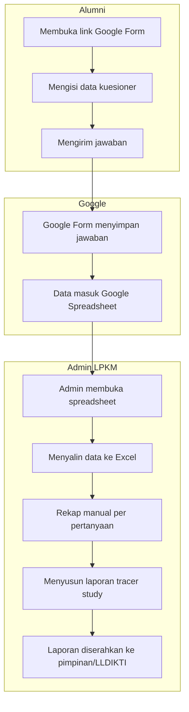
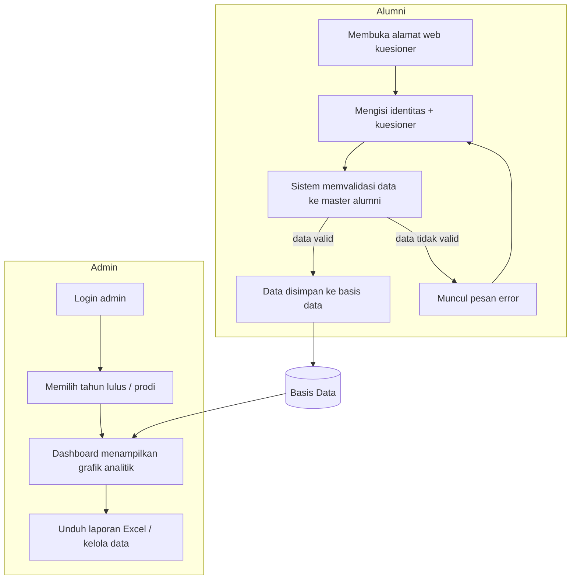
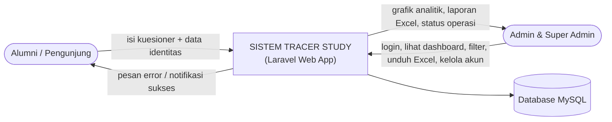
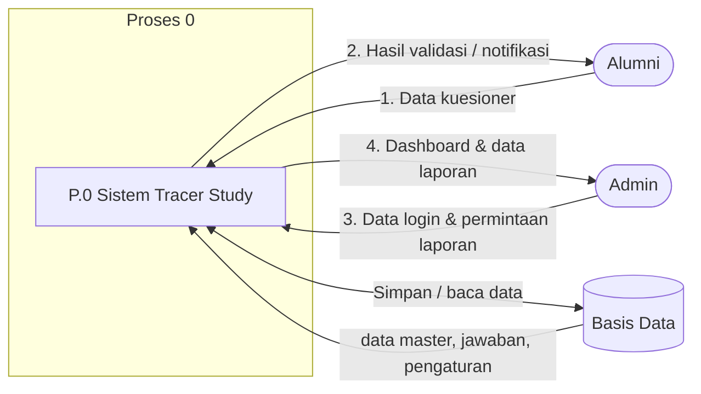
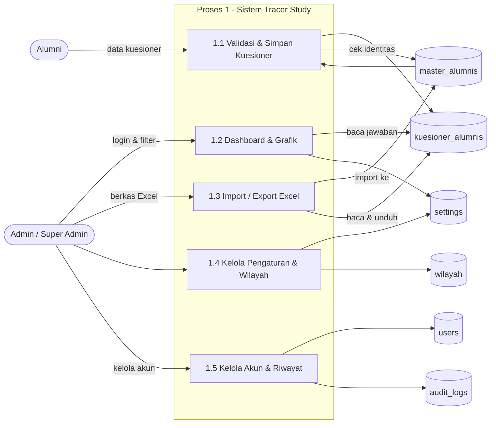
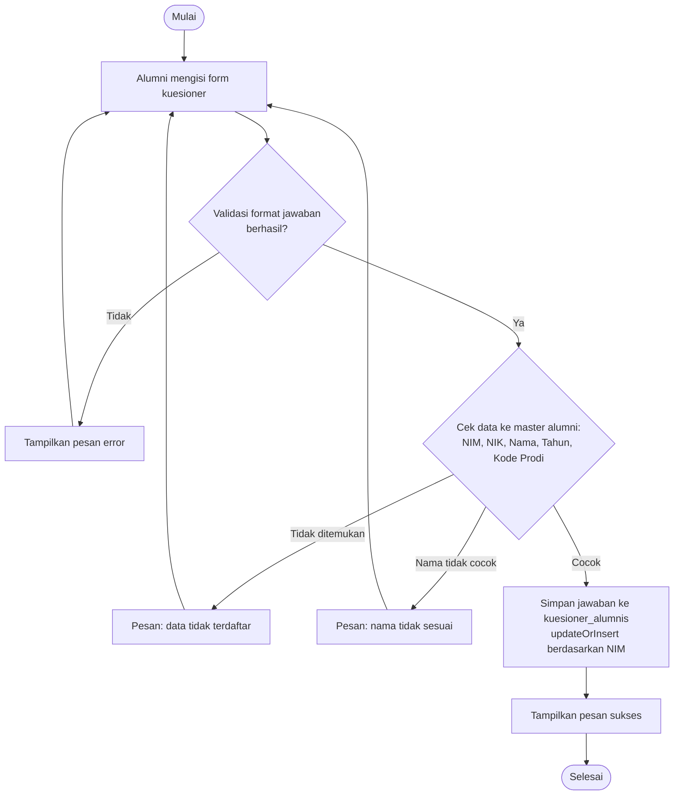
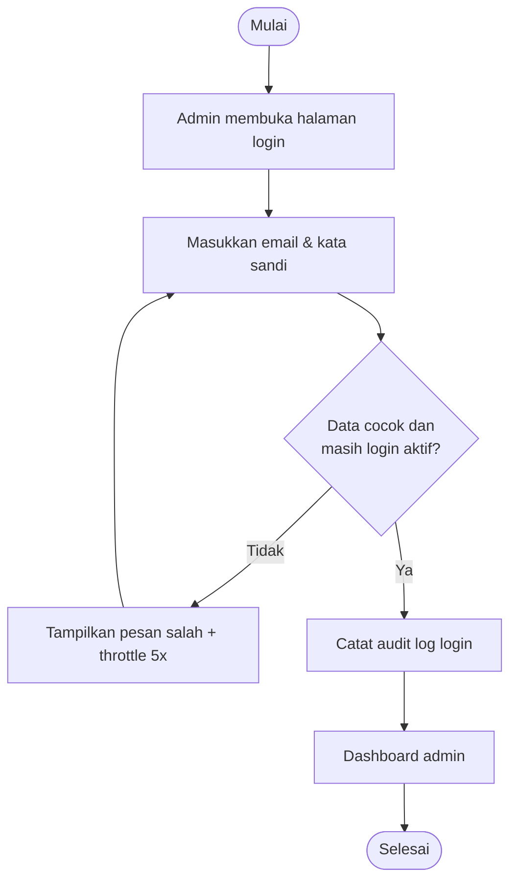
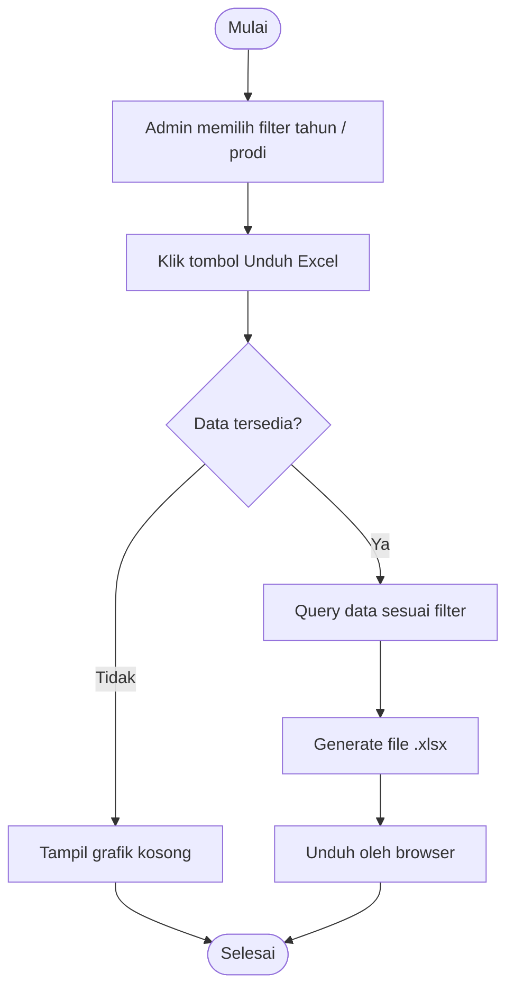
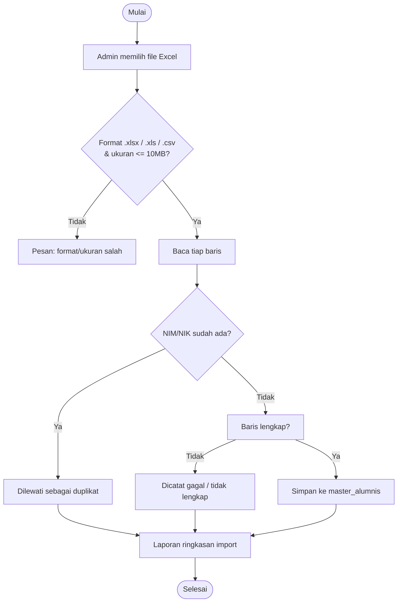
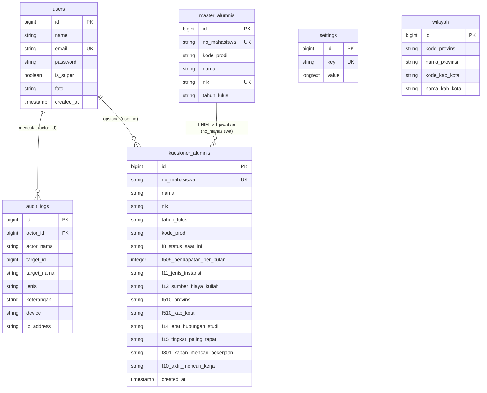

# BAB 3 — ANALISIS DAN PERANCANGAN SISTEM

> **Catatan untuk penulis:** Semua diagram pada bab ini ditulis dalam format **Mermaid** agar mudah dirender. Anda dapat menyalin/menempel kode diagram ke:
> - **VS Code** (ekstensi "Mermaid Preview"),
> - **GitHub** / **Obsidian** (render otomatis), atau
> - situs online **Mermaid Live Editor** (https://mermaid.live),
> lalu mengekspornya menjadi gambar (PNG/SVG) untuk ditempel ke dokumen skripsi.

---

## 3.1 Metodologi Penelitian

### 3.1.1 Jenis Penelitian

Penelitian ini menggunakan pendekatan **deskriptif kualitatif** dengan metode **pengembangan perangkat lunak**. Tahapan pembangunan sistem mengikuti model **Waterfall (SDLC)** yang terdiri atas:

1. **Analisis kebutuhan** — mengamati dan mewawancarai pengguna untuk mengetahui kebutuhan sistem tracer study.
2. **Perancangan sistem** — merancang aliran data, proses, basis data, dan antarmuka.
3. **Implementasi** — membangun aplikasi dengan framework **Laravel 12** (bahasa **PHP 8.2**).
4. **Pengujian** — menguji fungsionalitas melalui pengujian fitur (unit/feature test).
5. **Pemeliharaan** — perawatan dan penyempurnaan aplikasi setelah digunakan.

### 3.1.2 Teknik Pengumpulan Data

Teknik pengumpulan data yang digunakan:

1. **Observasi** — mengamati sistem pengumpulan data tracer study yang sedang berjalan (penggunaan Google Form dan rekap manual menggunakan Microsoft Excel oleh admin LPKM).
2. **Wawancara** — wawancara langsung dengan pengelola/petugas Lembaga Pengembangan Karir dan Mahasiswa (LPKM) untuk menggali kendala sistem lama dan kebutuhan sistem baru.
3. **Studi pustaka** — mempelajari buku, jurnal, serta regulasi standar **data LLDIKTI (Tracer Study)** sebagai acuan struktur pertanyaan kuesioner.

### 3.1.3 Perangkat yang Digunakan

**Perangkat keras (perangkat pengembangan):**

| No | Perangkat | Spesifikasi |
|---|---|---|
| 1 | Komputer | PC/Laptop |
| 2 | Prosesor | Intel Core i3 ke atas / AMD setara |
| 3 | RAM | Minimal 8 GB |
| 4 | Penyimpanan | HDD/SSD minimal 120 GB |

**Perangkat lunak:**

| No | Perangkat Lunak | Kegunaan |
|---|---|---|
| 1 | Windows 10/11 | Sistem operasi pengembangan |
| 2 | XAMPP (Apache + MySQL + PHP 8.2) | Web server dan basis data lokal |
| 3 | Laravel 12 | Framework backend aplikasi |
| 4 | MySQL | Basis data |
| 5 | Chart.js | Grafik dashboard analitik |
| 6 | Tailwind CSS v4 (CDN) | Styling antarmuka |
| 7 | Maatwebsite/Excel (Laravel Excel) | Import dan ekspor data Excel |
| 8 | Git | Kontrol versi |

---

## 3.2 Analisis Sistem yang Berjalan

### 3.2.1 Gambaran Umum Sistem Berjalan

Sistem pengumpulan data tracer study di LPKM saat ini masih dilakukan secara **semi-manual**:

1. Alumni mengisi data tracer study melalui **Google Form** yang dibagikan lewat grup media sosial.
2. Jawaban terkumpul di **Google Spreadsheet** tanpa proses validasi keaslian data (NIM/NIK tidak dicek ke data acuan).
3. Admin **menyalin dan mengolah data secara manual** ke Microsoft Excel untuk membuat laporan.
4. Laporan direkap berdasarkan pertanyaan-pertanyaan standar LLDIKTI.

### 3.2.2 Aliran Sistem Informasi yang Berjalan

Berikut aliran (flowmap) sistem pengumpulan data tracer study yang sedang berjalan.



### 3.2.3 Kelemahan Sistem Berjalan

Berdasarkan hasil observasi dan wawancara, sistem berjalan memiliki beberapa kelemahan:

1. **Tidak ada validasi keaslian data** — alumni dapat mengisi dengan NIM/NIK yang salah atau memalsukan data karena tidak ada pemeriksaan terhadap data acuan alumni.
2. **Data tidak terstruktur** — jawaban Google Form sulit direkap karena tidak terintegrasi dengan basis data.
3. **Proses rekap manual** — admin harus menyalin dan mengolah data satu per satu di Excel sehingga rawan salah hitung dan memakan waktu.
4. **Tidak ada visualisasi** — tidak tersedia dashboard grafik untuk melihat tren status alumni secara langsung.
5. **Rentan data ganda** — alumni dapat mengisi lebih dari satu kali sehingga hasil rekap bisa dobel.

---

## 3.3 Analisis Sistem yang Diusulkan

### 3.3.1 Gambaran Umum Sistem Usulan

Sistem yang diusulkan adalah **aplikasi web Tracer Study berbasis Laravel** yang menggantikan Google Form dan rekap manual. Sistem terdiri atas dua bagian utama:

1. **Sisi alumni (publik)** — halaman kuesioner yang dapat diakses semua orang. Sebelum data disimpan, sistem **memvalidasi NIM, NIK, Nama, Tahun Lulus, dan Kode Prodi** terhadap tabel *master alumni*. Satu NIM hanya dapat menyimpan **satu jawaban**.
2. **Sisi admin (terotentikasi)** — dashboard analitik grafik, filter tahun lulus/prodi, ekspor Excel, impor data master alumni, pengelolaan pengaturan kuesioner, data wilayah, akun admin, dan riwayat aktivitas.

Pertanyaan kuesioner disusun **sesuai standar data LLDIKTI** (F1 identitas, F8 status, F4 cara mencari kerja, F11 jenis instansi, F12 sumber dana, F14–F15 keselarasan, F17 kompetensi, F18 studi lanjut, dst.).

### 3.3.2 Aliran Sistem Informasi yang Diusulkan



### 3.3.3 Aktor dan Peran

| Aktor | Peran |
|---|---|
| **Alumni / Pengunjung** | Mengisi kuesioner tracer study secara online. Tidak perlu login. Data divalidasi otomatis terhadap data master alumni. |
| **Admin** | Login ke sistem. Melihat dashboard dan grafik, memfilter data (tahun lulus & prodi), mengunduh Excel, mengimpor data alumni, mengelola akun sendiri (ganti password, nama, foto). |
| **Super Admin Utama** | Admin dengan hak penuh (akun `is_super` pertama). Mengelola pengaturan kuesioner, opsi jawaban, pesan validasi, tampilan grafik, data wilayah, akun admin lain, kode pemulihan, dan melihat riwayat aktivitas. |

---

## 3.4 Analisis Kebutuhan

### 3.4.1 Kebutuhan Fungsional

| Kode | Kebutuhan Fungsional | Aktor |
|---|---|---|
| FR-01 | Sistem dapat menampilkan form kuesioner tracer study kepada publik | Alumni |
| FR-02 | Sistem dapat memvalidasi identitas alumni (NIM, NIK, Nama, Tahun Lulus, Kode Prodi) terhadap data master | Alumni |
| FR-03 | Sistem dapat menyimpan jawaban kuesioner; satu NIM hanya satu kali pengisian | Alumni |
| FR-04 | Sistem dapat menerapkan validasi server-side (kondisi jawaban mengikuti alur LLDIKTI, mis. status bekerja wajib isi lokasi kerja) | Alumni |
| FR-05 | Admin dapat login menggunakan email dan kata sandi | Admin |
| FR-06 | Admin dapat membuka/tutup akses kuesioner dari pengaturan | Super Admin |
| FR-07 | Admin dapat mengubah label pertanyaan, teks/instruksi, dan pesan error validasi | Super Admin |
| FR-08 | Admin dapat mengubah opsi jawaban (status, jenis instansi, sumber dana, dll.) yang otomatis memengaruhi form dan grafik | Super Admin |
| FR-09 | Admin dapat melihat dashboard analitik dengan filter tahun lulus dan program studi | Admin |
| FR-10 | Dashboard menampilkan grafik statistik (18 panel: status, pendapatan, instansi, dana, lokasi, kompetensi, metode, kurva masa tunggu, cara mencari kerja, keaktifan, alasan, dll.) | Admin |
| FR-11 | Admin dapat menyembunyikan/menampilkan tiap grafik dan mengubah bentuk/warna grafik | Super Admin |
| FR-12 | Admin dapat mengunduh (ekspor) data kuesioner ke file Excel sesuai filter | Admin |
| FR-13 | Admin dapat mengimpor data master alumni dari file Excel | Super Admin |
| FR-14 | Sistem dapat mengelola data wilayah (provinsi & kabupaten/kota) dengan CRUD | Super Admin |
| FR-15 | Super Admin dapat menambah/menghapus akun admin, mengatur status super, dan mereset password | Super Admin |
| FR-16 | Admin dapat mengganti password, nama, dan foto profil sendiri | Admin |
| FR-17 | Sistem mencatat riwayat aktivitas (login, logout, buat akun, reset password, dll.) | Super Admin |
| FR-18 | Super Admin dapat mereset password sendiri melalui kode pemulihan di halaman publik | Super Admin |

### 3.4.2 Kebutuhan Non-Fungsional

| Kode | Kebutuhan Non-Fungsional |
|---|---|
| NFR-01 | **Keamanan:** password disimpan dengan hash (bcrypt); validasi dilakukan di sisi server; pembatasan jumlah percobaan (throttling) pada login dan pengiriman kuesioner |
| NFR-02 | **Keandalan data:** identitas alumni diverifikasi terhadap data master; NIM unik sehingga tidak ada data ganda |
| NFR-03 | **Kompatibilitas:** aplikasi dapat dijalankan di shared hosting (PHP ≥ 8.2, MySQL); tidak memerlukan build Node.js (styling memakai Tailwind CDN) |
| NFR-04 | **Kinerja:** agregasi data grafik dilakukan dalam satu iterasi data; filter mempersempit kueri sesuai tahun/prodi |
| NFR-05 | **Kesesuaian standar:** struktur pertanyaan mengikuti standar data LLDIKTI tracer study |
| NFR-06 | **Kegunaan:** antarmuka responsif (Tailwind CSS), akses mudah dari perangkat seluler/desktop |

---

## 3.5 Perancangan Proses

### 3.5.1 Diagram Konteks



### 3.5.2 DFD Level 0



### 3.5.3 DFD Level 1



### 3.5.4 Flowchart

**a) Flowchart pengisian kuesioner dan validasi data alumni:**



**b) Flowchart login admin:**



**c) Flowchart ekspor data ke Excel:**



**d) Flowchart impor data master alumni:**



---

## 3.6 Perancangan Basis Data

### 3.6.1 Entity Relationship Diagram (ERD)



### 3.6.2 Rancangan Struktur Tabel

**1) Tabel `users`** — menyimpan akun admin.

| Kolom | Tipe | Keterangan |
|---|---|---|
| id | bigint (PK) | Auto increment |
| name | string(255) | Nama admin |
| email | string(255) | Email login (unik) |
| password | string(255) | Hash bcrypt |
| is_super | boolean | Penanda super admin |
| foto | string(255) | Nama file foto profil |
| created_at / updated_at | timestamp | Waktu |

**2) Tabel `master_alumnis`** — data acuan alumni (hasil impor Excel).

| Kolom | Tipe | Keterangan |
|---|---|---|
| id | bigint (PK) | Auto increment |
| no_mahasiswa | string(20) | NIM (unik) |
| kode_prodi | string(10) | Kode program studi |
| nama | string(150) | Nama lengkap |
| nik | string(20) | NIK (unik) |
| tahun_lulus | string(10) | Tahun kelulusan |

**3) Tabel `kuesioner_alumnis`** — jawaban kuesioner alumni. Hanya kolom utama yang ditampilkan; tabel lengkap berisi ±100 kolom sesuai standar LLDIKTI (F1–F27).

| Kolom | Tipe | Keterangan |
|---|---|---|
| id | bigint (PK) | Auto increment |
| no_mahasiswa | string(50) | NIM (unik, satu jawaban per NIM) |
| nama, nik, no_hp, email | string | Identitas alumni |
| tahun_lulus, kode_prodi, kode_PT | string | Data kelulusan |
| f8_status_saat_ini | string | Status saat ini (1–5) |
| f504_mendapat_pekerjaan_6_bulan | string | Mendapat kerja ≤ 6 bulan |
| f502_bulan_dapat_kerja / f505_pendapatan | integer | Masa tunggu & pendapatan |
| f510_provinsi / f510_kab_kota | string | Kode lokasi kerja |
| f11_jenis_instansi | string | Jenis instansi |
| f5b / f5c / f5d | string | Nama perusahaan, posisi, tingkat |
| f18a–f18d | string/date | Data studi lanjut |
| f12_sumber_biaya_kuliah | string | Sumber dana kuliah |
| f14_erat_hubungan_studi, f15_tingkat_paling_tepat | string | Keselarasan bidang |
| f1701_A–f1707_B | string | Matriks kompetensi (A dikuasai, B diperlukan) |
| f21–f27 | string | Penekanan metode pembelajaran |
| f301–f303 | string/integer | Waktu mulai mencari kerja |
| f401–f415 | boolean | Cara mencari kerja |
| f6 / f7 / f7a | integer | Jumlah lamaran, respons, wawancara |
| f10_aktif_mencari_kerja | string | Keaktifan mencari kerja |
| f1601–f1613 | boolean | Alasan pekerjaan tidak sesuai |

**4) Tabel `settings`** — menyimpan pengaturan (key–value).

| Kolom | Tipe | Keterangan |
|---|---|---|
| id | bigint (PK) | Auto increment |
| key | string(255) | Nama pengaturan (unik), mis. `opsi_f8_status`, `pesan_email_domain` |
| value | longtext | Nilai pengaturan |

**5) Tabel `wilayah`** — data provinsi dan kabupaten/kota (35 provinsi, 523 kab/kota).

| Kolom | Tipe | Keterangan |
|---|---|---|
| id | bigint (PK) | Auto increment |
| kode_provinsi | string | Kode provinsi |
| nama_provinsi | string | Nama provinsi |
| kode_kab_kota | string | Kode kab/kota (null untuk baris provinsi) |
| nama_kab_kota | string | Nama kab/kota (null untuk baris provinsi) |

**6) Tabel `audit_logs`** — riwayat aktivitas admin.

| Kolom | Tipe | Keterangan |
|---|---|---|
| id | bigint (PK) | Auto increment |
| actor_id | bigint | ID admin pelaku (FK users) |
| actor_nama | string | Nama admin pelaku |
| target_id / target_nama | bigint/string | Sasaran aktivitas |
| jenis | string | `login`, `logout`, `buat_akun`, `reset_password`, dsb. |
| keterangan | string | Penjelasan aktivitas |
| device | string(512) | Perangkat/browser |
| ip_address | string(45) | Alamat IP |

---

## 3.7 Perancangan Antarmuka

### 3.7.1 Struktur Menu

**Halaman publik:**

```
/ (redirect)  →  /kuesioner
├── /kuesioner          Form kuesioner tracer study (publik)
└── /login              Halaman login admin
    └── /pemulihan      Reset password super admin (kode pemulihan)
```

**Halaman admin (setelah login):**

```
/dashboard-kurva           Dashboard analitik (grafik + filter)
├── filter: Tahun Lulus & Program Studi
├── kartu ringkasan (Total Responden, Bekerja, Aktif Mencari Kerja, Lanjut Kuliah)
├── 18 panel grafik (pie, doughnut, bar, line, radar)
├── Unduh Excel
└── Menu navigasi:
    ├── ⚙️ Pengaturan (/admin/pengaturan)
    │   ├── Identitas kuesioner (judul, teks, warna)
    │   ├── Opsi jawaban kuesioner (status, instansi, dana, dll.)
    │   ├── Pesan error validasi
    │   ├── Tampilan & bentuk grafik dashboard
    │   └── 🗺️ Data Wilayah (CRUD provinsi & kab/kota)
    ├── + Kelola Data Alumni (impor Excel, /admin/alumni/import)
    ├── 👥 Akun Admin (/admin/akun)
    ├── 🔑 Ganti Password
    ├── 📜 Riwayat Login & Aktivitas (/admin/riwayat)
    └── Keluar (/logout)
```

### 3.7.2 Rancangan Halaman

**a) Rancangan halaman kuesioner (publik):**

```
┌────────────────────────────────────────────────────────┐
│  🎓 KUESIONER TRACER STUDY                             │
│  Universitas Mahaputra Muhammad Yamin - LPKM           │
│  -----------------------------------------------------  │
│  A. Identitas Alumni            (kolom teks, dropdown)  │
│     NIM, Kode PT, Tahun Lulus, Kode Prodi, Nama,       │
│     No HP, Email, NIK, NPWP                            │
│  B. Jelaskan status Anda saat ini? (radio)             │
│     ◉ Bekerja  ○ Wiraswasta  ○ Melanjutkan Pendidikan  │
│     ○ Cari kerja  ○ Belum memungkinkan bekerja         │
│  C. Detail Tempat Bekerja (dropdown provinsi/kab-kota, │
│     jenis instansi, nama perusahaan, posisi)           │
│  D. ... (pertanyaan F4 - F27 sesuai standar LLDIKTI)   │
│  ┌──────────────────────────────────────────┐          │
│  │        SIMPAN DAN KIRIM DATA KUESIONER   │          │
│  └──────────────────────────────────────────┘          │
└────────────────────────────────────────────────────────┘
```

**b) Rancangan dashboard admin:**

```
┌────────────────────────────────────────────────────────┐
│ 📊 Analitik Tracer Study   [Tahun ▼][Prodi ▼] [⚡ Buka] │
│ ┌────────┐ ┌────────┐ ┌────────┐ ┌────────┐            │
│ │Total   │ │Bekerja │ │Aktif   │ │Lanjut  │  [Unduh]   │
│ │Respond.│ │💼      │ │Mencari │ │Kuliah  │   Excel    │
│ └────────┘ └────────┘ └────────┘ └────────┘            │
│  ┌─────────────────┐  ┌─────────────────┐              │
│  │ Status Kerja    │  │ Pendapatan      │              │
│  │   (pie chart)   │  │ (doughnut chart)│              │
│  └─────────────────┘  └─────────────────┘              │
│  ┌─────────────────┐  ┌─────────────────┐              │
│  │ Kompetensi A vs │  │ Kurva masa      │              │
│  │ B (radar)       │  │ tunggu (line)   │              │
│  └─────────────────┘  └─────────────────┘              │
│  ... (18 panel grafik)                                 │
└────────────────────────────────────────────────────────┘
```

**c) Rancangan halaman pengaturan (super admin):**

```
┌────────────────────────────────────────────────────────┐
│ ⚙️ Pengaturan                                          │
│  ┌────────────────────────────────────────────────┐    │
│  │ Kuesioner  (judul, teks, status buka/tutup,    │    │
│  │             warna, email domain)               │    │
│  ├────────────────────────────────────────────────┤    │
│  │ Opsi Jawaban  (opsi_f8_status, f11, f12, dst.) │    │
│  ├────────────────────────────────────────────────┤    │
│  │ Pesan Error Validasi (20 pesan)                │    │
│  ├────────────────────────────────────────────────┤    │
│  │ Dashboard & Grafik (bentuk, warna, tampil/     │    │
│  │             sembunyi tiap grafik)              │    │
│  ├────────────────────────────────────────────────┤    │
│  │ 🗺️ Data Wilayah (tabel provinsi + kab/kota,   │    │
│  │             tambah/edit/hapus)                 │    │
│  └────────────────────────────────────────────────┘    │
│  [💾 Simpan Pengaturan]                                │
└────────────────────────────────────────────────────────┘
```

---

## 3.8 Rancangan Pertanyaan Kuesioner (Standar LLDIKTI)

Pertanyaan kuesioner pada aplikasi disusun mengikuti kode bidang data **tracer study LLDIKTI (F1–F27)**. Berikut daftar bagian dan pertanyaannya yang dirancang dalam sistem.

### 3.8.1 Bagian A — Identitas Alumni (F1)

| No | Kolom | Jenis Input |
|---|---|---|
| 1 | Nomor Induk Mahasiswa (NIM) | Teks |
| 2 | Kode Perguruan Tinggi | Teks (default otomatis) |
| 3 | Tahun Lulus | Dropdown |
| 4 | Kode Program Studi | Dropdown |
| 5 | Nama Lengkap | Teks |
| 6 | Nomor Telepon / HP | Teks (format `08xxxxxxxxxx`) |
| 7 | Alamat Email | Teks (divalidasi domain email) |
| 8 | NIK (Nomor Induk Kependudukan) | Teks (wajib 16 digit) |
| 9 | NPWP | Teks (opsional) |

### 3.8.2 Bagian B — Status Alumni (F8, F504, F502, F505, F506)

**B.1 — "Jelaskan status Anda saat ini?"** *(F8, pilihan tunggal)*

| Nilai | Opsi |
|---|---|
| 1 | Bekerja (full time / part time) |
| 3 | Wiraswasta |
| 4 | Melanjutkan Pendidikan |
| 5 | Tidak Kerja tetapi sedang mencari kerja |
| 2 | Belum memungkinkan bekerja |

**B.2 — "Apakah Anda telah mendapatkan pekerjaan ≤ 6 bulan (termasuk bekerja sebelum lulus)?"** *(F504, pilihan Ya/Tidak)*

| Nilai | Opsi |
|---|---|
| 1 | Ya |
| 2 | Tidak |

Jika **Ya** → "Dalam berapa bulan Anda mendapatkan pekerjaan?" *(F502)* dan "Berapa rata-rata pendapatan per bulan? (take home pay)" *(F505)*.
Jika **Tidak** → "Diisi jika lebih dari 6 bulan belum mendapatkan pekerjaan" *(F506)*.

### 3.8.3 Bagian C — Detail Tempat Bekerja (F510, F11, F5b, F5c, F5d)

**C.1 — "Di mana lokasi tempat Anda bekerja?"** *(F510)* — dropdown **Provinsi** dan **Kabupaten/Kota** (data wilayah, 35 provinsi & 523 kab/kota). Bagi yang belum bekerja tersedia pilihan "Belum Bekerja".

**C.2 — "Apa jenis perusahaan/instansi/institusi tempat Anda bekerja sekarang?"** *(F11, pilihan tunggal)*

| Nilai | Opsi |
|---|---|
| 1 | Instansi pemerintah |
| 2 | BUMN/BUMD |
| 3 | Institusi/Organisasi Multilateral |
| 4 | Organisasi non-profit/Lembaga Swadaya Masyarakat |
| 5 | Perusahaan swasta |
| 6 | Wiraswasta/Perusahaan sendiri |
| 7 | Lainnya |

**C.3 —** Nama perusahaan/kantor *(F5b)*, posisi/jabatan bila wiraswasta *(F5c: Founder, Co-Founder, Staff, Freelance)*, dan tingkat tempat kerja *(F5d: Lokal, Nasional, Internasional)*.

### 3.8.4 Bagian D — Studi Lanjut & Pembiayaan Kuliah (F18, F12)

**D.1 — Pertanyaan Studi Lanjut (F18, wajib jika status = Melanjutkan Pendidikan):**
- Sumber biaya studi *(F18a)*: Biaya Sendiri / Beasiswa
- Perguruan tinggi tujuan studi *(F18b)*
- Program studi tujuan *(F18c)*
- Tanggal masuk *(F18d)*

**D.2 — "Sebutkan sumber dana dalam pembiayaan kuliah?"** *(F12, pilihan tunggal)*

| Nilai | Opsi |
|---|---|
| 1 | Biaya Sendiri / Keluarga |
| 2 | Beasiswa ADIK |
| 3 | Beasiswa BIDIKMISI |
| 4 | Beasiswa PPA |
| 5 | Beasiswa AFIRMASI |
| 6 | Beasiswa Perusahaan/Swasta |
| 7 | Lainnya |

### 3.8.5 Bagian E — Keselarasan Bidang Studi (F14, F15)

**E.1 — "Seberapa erat hubungan antara bidang studi dengan pekerjaan Anda?"** *(F14)*: Sangat Erat / Erat / Cukup Erat / Kurang Erat / Tidak Sama Sekali.

**E.2 — "Tingkat pendidikan apa yang paling tepat/sesuai untuk pekerjaan Anda saat ini?"** *(F15)*: Setingkat Lebih Tinggi / Tingkat yang Sama / Setingkat Lebih Rendah / Tidak Perlu Pendidikan Tinggi.

### 3.8.6 Bagian F — Kompetensi (F17)

Matriks 7 aspek kompetensi dengan dua penilaian skala 1–5 (Sangat Rendah–Sangat Tinggi):

| No | Aspek Kompetensi | A: Kompetensi Saat Lulus | B: Kebutuhan di Pekerjaan |
|---|---|---|---|
| 1 | Etika | skala 1–5 | skala 1–5 |
| 2 | Keahlian berdasarkan bidang ilmu | skala 1–5 | skala 1–5 |
| 3 | Bahasa Inggris | skala 1–5 | skala 1–5 |
| 4 | Penggunaan Teknologi Informasi | skala 1–5 | skala 1–5 |
| 5 | Komunikasi | skala 1–5 | skala 1–5 |
| 6 | Kerja sama tim | skala 1–5 | skala 1–5 |
| 7 | Pengembangan Diri | skala 1–5 | skala 1–5 |

### 3.8.7 Bagian G — Penekanan Metode Pembelajaran (F2/F21–F27)

"Seberapa besar penekanan pada metode pembelajaran berikut dilaksanakan di program studi Anda?" *(skala: Sangat Besar, Besar, Cukup, Kurang, Tidak Sama Sekali)*: Perkuliahan, Demonstrasi, Partisipasi dalam proyek riset, Magang, Praktikum, Kerja Lapangan, Diskusi.

### 3.8.8 Bagian H — Kapan Mulai Mencari Pekerjaan (F301–F303)

| No | Pertanyaan | Jenis Input |
|---|---|---|
| 1 | Berapa bulan **sebelum** lulus Anda mulai mencari kerja? (F302) | Angka |
| 2 | Berapa bulan **sesudah** lulus Anda mulai mencari kerja? (F303) | Angka |
| 3 | Saya tidak mencari kerja (langsung ke bagian berikutnya) | Pilihan |

### 3.8.9 Bagian I — Cara Mencari Pekerjaan (F401–F415)

"Bagaimana cara Anda mencari pekerjaan tersebut?" *(jawaban bisa lebih dari satu / checkbox):*

| No | Kode | Opsi |
|---|---|---|
| 1 | F401 | Melalui iklan di koran/majalah, brosur |
| 2 | F402 | Melamar ke perusahaan tanpa mengetahui lowongan yang ada |
| 3 | F403 | Pergi ke bursa/pameran kerja |
| 4 | F404 | Mencari lewat internet/iklan online/milis |
| 5 | F405 | Dihubungi oleh perusahaan |
| 6 | F406 | Menghubungi Kemenakertrans |
| 7 | F407 | Menghubungi agen tenaga kerja komersial/swasta |
| 8 | F408 | Memperoleh informasi dari pusat/kantor pengembangan karir fakultas/universitas |
| 9 | F409 | Menghubungi kantor kemahasiswaan/hubungan alumni |
| 10 | F410 | Membangun jejaring (network) sejak masih kuliah |
| 11 | F411 | Melalui relasi (misalnya dosen, orang tua, saudara, teman) |
| 12 | F412 | Membangun bisnis sendiri |
| 13 | F413 | Melalui penempatan kerja atau magang |
| 14 | F414 | Bekerja di tempat yang sama dengan tempat kerja semasa kuliah |
| 15 | F415 | Lainnya |

### 3.8.10 Bagian J — Proses Lamaran Pekerjaan (F6, F7, F7a)

| No | Pertanyaan | Jenis Input |
|---|---|---|
| 1 | Berapa perusahaan/instansi yang sudah Anda lamar sebelum memperoleh pekerjaan pertama? (F6) | Angka |
| 2 | Berapa banyak perusahaan/instansi yang merespons lamaran Anda selama ini? (F7) | Angka |
| 3 | Berapa banyak perusahaan/instansi yang mengundang Anda untuk wawancara? (F7a) | Angka |

### 3.8.11 Bagian K — Keaktifan Mencari Kerja (F10)

"Apakah Anda aktif mencari pekerjaan dalam 4 minggu terakhir?" *(pilihan tunggal):* Tidak / Tidak, tapi menunggu hasil lamaran / Ya, akan mulai bekerja dalam 2 minggu ke depan / Ya, tapi belum pasti bekerja dalam 2 minggu ke depan / Lainnya.

### 3.8.12 Bagian L — Alasan Mengambil Pekerjaan Tidak Sesuai (F1601–F1613)

"Jika pekerjaan Anda saat ini tidak sesuai dengan pendidikan, mengapa Anda mengambilnya?" *(jawaban bisa lebih dari satu / checkbox):*

| No | Kode | Opsi |
|---|---|---|
| 1 | F1601 | Pertanyaan tidak sesuai; pekerjaan saya sekarang sudah sesuai pendidikan |
| 2 | F1602 | Belum mendapatkan pekerjaan yang lebih sesuai |
| 3 | F1603 | Memperoleh prospek karir yang baik |
| 4 | F1604 | Lebih suka bekerja di area yang tidak berhubungan dengan pendidikan |
| 5 | F1605 | Dipromosikan ke posisi yang kurang berhubungan dengan pendidikan |
| 6 | F1606 | Memperoleh pendapatan yang lebih tinggi |
| 7 | F1607 | Pekerjaan lebih aman/terjamin |
| 8 | F1608 | Pekerjaan lebih menarik |
| 9 | F1609 | Memungkinkan mengambil pekerjaan tambahan/jadwal fleksibel |
| 10 | F1610 | Lokasinya lebih dekat dari rumah |
| 11 | F1611 | Lebih menjamin kebutuhan keluarga |
| 12 | F1612 | Pada awal meniti karir harus menerima pekerjaan tidak sesuai pendidikan |
| 13 | F1613 | Lainnya |

---

*Selesai — Bab 3 Analisis dan Perancangan Sistem. Seluruh perancangan di atas merupakan representasi dari sistem nyata yang dibangun menggunakan Laravel 12 dan sudah teruji (18 pengujian otomatis).*
