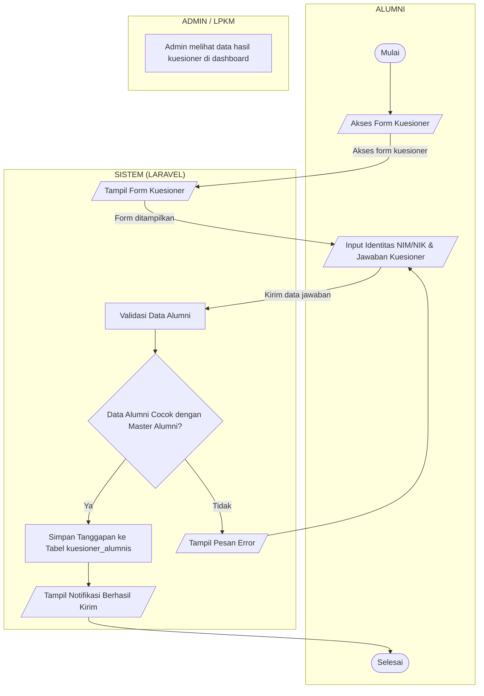

# Bab 3 — Aliran Sistem Informasi (ASI)
## Sistem Informasi Tracer Study LPKM UMMY

Aliran Sistem Informasi (ASI) merupakan gambaran tentang bagaimana data dan informasi mengalir di dalam sistem beserta urutan langkah proses yang terjadi pada setiap entitas yang terlibat. Pada Sistem Informasi Tracer Study LPKM UMMY, ASI disajikan dalam bentuk *swimlane* (lajur) yang memisahkan tiga entitas, yaitu ALUMNI sebagai pengisi kuesioner, SISTEM (LARAVEL) sebagai aplikasi yang memproses data, dan ADMIN/LPKM sebagai pengelola sistem yang dapat melihat hasil kuesioner. Aliran informasi digambarkan mulai dari alumni membuka halaman kuesioner, sistem menampilkan formulir, alumni menginput identitas dan jawaban, sistem memvalidasi data terhadap data acuan pada tabel `master_alumnis`, hingga jawaban disimpan ke dalam tabel `kuesioner_alumnis` dan notifikasi keberhasilan ditampilkan kepada alumni.

```
ALUMNI                     SISTEM (LARAVEL)                 ADMIN / LPKM
───────────────────────   ───────────────────────────────   ───────────────────────
         (Mulai)
           │
           ▼
   [/ Akses Form Kuesioner /]
           │
           └───────────────────────────────►
                                           │
                                           ▼
                               [/ Tampil Form Kuesioner /]
                                           │
   ◄───────────────────────────────────────┘
   ▼
   [/ Input Identitas (NIM/NIK) /]
   [/ & Jawaban Kuesioner       /] ◄────────────────────────────┐
           │                                                    │
           └────────────────────────────────►                   │
                                            │                   │
                                            ▼                   │
                               [ Validasi Data Alumni ]         │
                                            │                   │
                                            ▼                   │
                                  / Data Alumni \               │
                                 <  Cocok dengan  > ──(Tidak) ──┘
                                  \Master Alumni?/
                                            │
                                         (Ya)
                                            ▼
                               [ Simpan Tanggapan ke ]
                               [ Tabel kuesioner_alumnis ]
                                            │
                                            ▼
                               [/ Tampil Notifikasi  /]
                               [/  Berhasil Kirim    /]
                                            │
   ◄────────────────────────────────────────┘
   ▼
        (Selesai)
```

**Keterangan aliran informasi:**

1. **Alumni → Sistem:** alumni memulai proses dengan membuka form kuesioner.
2. **Sistem → Alumni:** sistem menampilkan form kuesioner kepada alumni.
3. **Alumni → Sistem:** alumni menginput identitas (NIM/NIK) dan seluruh jawaban kuesioner.
4. **Sistem:** sistem memvalidasi data alumni dengan mencocokkan NIM, NIK, tahun lulus, dan kode prodi terhadap tabel `master_alumnis`.
5. **Sistem → Alumni (Tidak cocok):** apabila data tidak cocok, sistem menampilkan pesan error dan mengembalikan alumni ke langkah input untuk mengulang pengisian.
6. **Sistem (Ya cocok):** apabila data cocok, sistem menyimpan jawaban ke tabel `kuesioner_alumnis` dan menampilkan notifikasi bahwa kuesioner berhasil dikirim, kemudian proses berakhir.
7. **ADMIN/LPKM:** admin tidak terlibat langsung dalam alur pengisian kuesioner, tetapi dapat melihat seluruh data hasil kuesioner melalui halaman dashboard analitik.

---

## Kode Mermaid (untuk dirender menjadi gambar)


