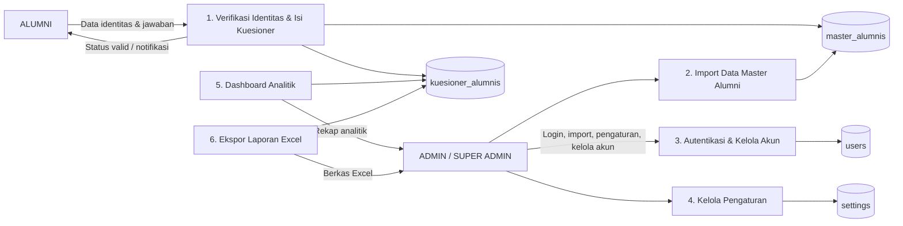

# Bab 3 — DFD Level 1
## Sistem Informasi Tracer Study LPKM UMMY

Diagram Arus Data (Data Flow Diagram/DFD) Level 1 merupakan pemecahan lebih rinci dari diagram konteks yang menggambarkan proses-proses utama di dalam sistem beserta aliran data yang menghubungkan setiap proses dengan entitas eksternal dan data store. Pada Sistem Informasi Tracer Study LPKM UMMY, DFD Level 1 terdiri atas enam proses utama, yaitu verifikasi identitas dan pengisian kuesioner, impor data master alumni, autentikasi dan pengelolaan akun, pengelolaan pengaturan, dashboard analitik, serta ekspor laporan Excel. Setiap proses tersebut berinteraksi dengan empat data store, yaitu `master_alumnis` sebagai data acuan verifikasi alumni, `users` sebagai data akun admin, `settings` sebagai data pengaturan aplikasi, dan `kuesioner_alumnis` sebagai data hasil jawaban tracer study. DFD Level 1 ini memperlihatkan alur pengolahan data secara lebih terperinci sehingga dapat dijadikan acuan dalam pengembangan setiap modul sistem.

```
                                       Data identitas & jawaban
 ┌──────────────┐  ────────────────────────────────►  ┌──────────────────────────┐
 │    ALUMNI    │                                     │ 1. Verifikasi Identitas   │
 │              │ ◄────────────────────────────────   │    & Isi Kuesioner       │
 └──────────────┘     Status valid/tidak valid,       └────────────┬─────────────┘
                                notifikasi                        │
                                                              simpan jawaban
                                                                  │
                                                      ┌───────────▼─────────────┐
                                                      │   D1 master_alumnis     │
   Data login, data master alumni                     └───────────┬─────────────┘
   (Excel), pengaturan, data akun                                │  cek data acuan
 ┌──────────────┐  ────────────────────────────────►  ┌───────────▼─────────────┐
 │ ADMIN /      │                                     │   2. Import Data Master │
 │ SUPER ADMIN  │ ◄────────────────────────────────   │      Alumni             │
 └──────────────┘     Rekap analitik, laporan Excel,  └───────────┬─────────────┘
                                info data alumni                  │
                                                                  ▼
   ┌───────────────────────────────────────────────────────────────────────────────┐
   │                                                                               │
   │  ┌──────────────────────┐   ┌──────────────────────┐   ┌────────────────────┐  │
   │  │ 3. Autentikasi &     │   │ 4. Kelola Pengaturan │   │ 5. Dashboard       │  │
   │  │    Kelola Akun       │   │                      │   │    Analitik        │  │
   │  └───────────┬──────────┘   └──────────┬───────────┘   └─────────┬──────────┘  │
   │              │                        │                         │             │
   │   ┌──────────▼──────────┐   ┌─────────▼──────────┐   ┌──────────▼──────────┐   │
   │   │ D2 users            │   │ D4 settings        │   │ D5 kuesioner_alumnis│   │
   │   └─────────────────────┘   └────────────────────┘   └─────────────────────┘   │
   │                                                                               │
   │                                   ┌───────────────────────────────┐           │
   │                                   │ 6. Ekspor Laporan Excel      │           │
   │                                   └──────────────┬────────────────┘           │
   │                                                  ▼                           │
   │                                        D5 kuesioner_alumnis                   │
   └───────────────────────────────────────────────────────────────────────────────┘
```

**Keterangan:**

| Proses | Nama Proses | Keterangan |
|--------|-------------|------------|
| 1 | Verifikasi Identitas & Isi Kuesioner | Menerima data identitas dan jawaban alumni, memverifikasi ke data acuan master, kemudian menyimpan ke `kuesioner_alumnis` |
| 2 | Import Data Master Alumni | Menerima berkas Excel, membaca melalui `AlumniImport`, lalu menyimpan ke `master_alumnis` |
| 3 | Autentikasi & Kelola Akun | Memproses login/logout, pemulihan password, serta CRUD akun admin pada `users` |
| 4 | Kelola Pengaturan | Membaca dan menyimpan pengaturan aplikasi pada `settings` |
| 5 | Dashboard Analitik | Mengambil data dari `kuesioner_alumnis`, menghitung agregasi untuk grafik |
| 6 | Ekspor Laporan Excel | Mengambil data dari `kuesioner_alumnis` dan membentuk berkas laporan |

**Data Store:**

| Simbol | Data Store |
|--------|------------|
| D1 | `master_alumnis` (data acuan verifikasi alumni) |
| D2 | `users` (data akun admin) |
| D3 | `settings` (pengaturan aplikasi) |
| D4 | `kuesioner_alumnis` (hasil jawaban tracer study) |

---

## Kode Mermaid (cadangan)


