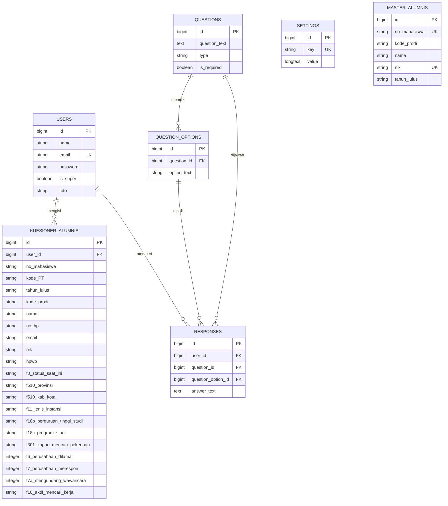

# Bab 3 — Entity Relationship Diagram (ERD)
## Sistem Informasi Tracer Study LPKM UMMY

Entity Relationship Diagram (ERD) merupakan diagram yang menggambarkan hubungan antar entitas beserta atribut-atributnya di dalam basis data. Pada Sistem Informasi Tracer Study LPKM UMMY, ERD memetakan tujuh entitas, yaitu `users` sebagai data akun admin, `settings` sebagai data pengaturan, `master_alumnis` sebagai data acuan alumni, `kuesioner_alumnis` sebagai data hasil jawaban tracer study, `questions` sebagai data pertanyaan kuesioner, `question_options` sebagai data pilihan jawaban, dan `responses` sebagai data jawaban responden. Hubungan antar entitas tersebut terdiri atas relasi satu ke banyak, antara lain `users` dengan `kuesioner_alumnis`, `users` dengan `responses`, `questions` dengan `question_options`, `questions` dengan `responses`, serta `question_options` dengan `responses`. Sementara itu, entitas `master_alumnis` berfungsi sebagai data acuan yang digunakan untuk memverifikasi identitas alumni berdasarkan kombinasi nomor mahasiswa, nomor induk kependudukan, tahun lulus, dan kode program studi tanpa kunci asing fisik. ERD ini menjadi dasar perancangan struktur tabel pada *database* sistem.

### 1. Hubungan antar entitas

```
  users ──────────1 ──◄─────N── kuesioner_alumnis
    │                               (user_id)
    │
    │ 1
    │
    └─────────N── responses
                   (user_id)

  questions ──────1 ──◄─────N── question_options
     │                (question_id)
     │ 1
     │
     └─────────N── responses
                    (question_id)

  question_options ─1 ──◄─────N── responses
                       (question_option_id)

  master_alumnis ───────────────► (referensi verifikasi, tanpa FK fisik)
       no_mahasiswa + nik + tahun_lulus + kode_prodi = kunci verifikasi
                                    │
                                    ▼
                          kuesioner_alumnis
```

### 2. Struktur atribut setiap entitas

```
┌─────────────────────────────────────────────────────────────┐
│  ENTITAS: users                                             │
├──────────────┬──────────────────────────────────────────────┤
│ id           │ PK (Primary Key)                             │
│ name         │                                              │
│ email        │ UNIQUE                                       │
│ password     │ (tersimpan terenkripsi/hash)                 │
│ is_super     │ status super admin (boolean)                 │
│ foto         │                                              │
│ remember_token                                              │
│ created_at, updated_at                                      │
└─────────────────────────────────────────────────────────────┘

┌─────────────────────────────────────────────────────────────┐
│  ENTITAS: settings                                          │
├──────────────┬──────────────────────────────────────────────┤
│ id           │ PK                                           │
│ key          │ UNIQUE (kunci pengaturan)                    │
│ value        │ nilai pengaturan                             │
│ created_at, updated_at                                      │
└─────────────────────────────────────────────────────────────┘

┌─────────────────────────────────────────────────────────────┐
│  ENTITAS: master_alumnis                                    │
├──────────────────┬──────────────────────────────────────────┤
│ id               │ PK                                       │
│ no_mahasiswa     │ UNIQUE (NIM sebagai kunci pencarian)     │
│ kode_prodi       │                                          │
│ nama             │                                          │
│ nik              │ UNIQUE (NIK)                             │
│ tahun_lulus      │                                          │
│ created_at, updated_at                                      │
└─────────────────────────────────────────────────────────────┘

┌─────────────────────────────────────────────────────────────┐
│  ENTITAS: kuesioner_alumnis                                 │
├──────────────────────┬──────────────────────────────────────┤
│ id                   │ PK                                   │
│ user_id              │ FK → users.id                        │
│ no_mahasiswa         │ identitas alumni                     │
│ kode_PT              │ kode perguruan tinggi                │
│ tahun_lulus          │                                      │
│ kode_prodi           │                                      │
│ nama, no_hp, email   │                                      │
│ nik, npwp            │                                      │
│ f8_status_saat_ini   │ status kesibukan                     │
│ f504_... , f502_..., │ f505_..., f506_...                   │
│ f510_provinsi, f510_kab_kota                                │
│ f11_jenis_instansi, f11_jenis_instansi_lainnya              │
│ f5b_nama_perusahaan, f5c_posisi_wiraswasta,                 │
│ f5d_tingkat_tempat_kerja                                    │
│ f18a_sumber_biaya_studi, f18b_perguruan_tinggi_studi,       │
│ f18c_program_studi, f18d_tanggal_masuk                      │
│ f12_sumber_biaya_kuliah, f12_sumber_biaya_kuliah_lainnya    │
│ f14_erat_hubungan_studi, f15_tingkat_paling_tepat           │
│ f1701_A s.d. f1707_A, f1701_B s.d. f1707_B                  │
│ f21_perkuliahan s.d. f27_diskusi                            │
│ f301_kapan_mencari_pekerjaan, f302_bulan_sebelum_lulus,     │
│ f303_bulan_setelah_lulus                                    │
│ f401 s.d. f416 (cara mencari pekerjaan)                     │
│ f6_perusahaan_dilamar, f7_perusahaan_merespon,              │
│ f7a_mengundang_wawancara                                    │
│ f10_aktif_mencari_kerja, f10_lainnya                        │
│ f1601 s.d. f1614 (alasan pekerjaan tidak sesuai)            │
│ created_at, updated_at                                      │
└─────────────────────────────────────────────────────────────┘

┌─────────────────────────────────────────────────────────────┐
│  ENTITAS: questions                                         │
├──────────────┬──────────────────────────────────────────────┤
│ id           │ PK                                           │
│ question_text│ teks pertanyaan                              │
│ type         │ text / radio / select                        │
│ is_required  │ penanda wajib isi (boolean)                  │
│ created_at, updated_at                                      │
└─────────────────────────────────────────────────────────────┘

┌─────────────────────────────────────────────────────────────┐
│  ENTITAS: question_options                                  │
├──────────────┬──────────────────────────────────────────────┤
│ id           │ PK                                           │
│ question_id  │ FK → questions.id (cascade delete)           │
│ option_text  │ teks pilihan jawaban                         │
│ created_at, updated_at                                      │
└─────────────────────────────────────────────────────────────┘

┌─────────────────────────────────────────────────────────────┐
│  ENTITAS: responses                                         │
├────────────────────┬────────────────────────────────────────┤
│ id                 │ PK                                     │
│ user_id            │ FK → users.id (nullable)               │
│ question_id        │ FK → questions.id                      │
│ question_option_id │ FK → question_options.id (nullable)    │
│ answer_text        │ isi jawaban (nullable)                 │
│ created_at, updated_at                                      │
└─────────────────────────────────────────────────────────────┘
```

### 3. Derajat relasi

| Relasi | Entitas 1 | Entitas 2 | Derajat | Keterangan |
|--------|-----------|-----------|---------|------------|
| 1 | `users` | `kuesioner_alumnis` | 1 : N | satu pengguna dapat memiliki banyak data kuesioner |
| 2 | `users` | `responses` | 1 : N | satu pengguna dapat mengisi banyak jawaban |
| 3 | `questions` | `question_options` | 1 : N | satu pertanyaan dapat memiliki banyak pilihan jawaban |
| 4 | `questions` | `responses` | 1 : N | satu pertanyaan dapat dijawab oleh banyak responden |
| 5 | `question_options` | `responses` | 1 : N | satu pilihan jawaban dapat dipilih oleh banyak responden |
| 6 | `master_alumnis` | `kuesioner_alumnis` | referensi | verifikasi identitas berdasarkan NIM, NIK, tahun lulus, dan kode prodi (tanpa kunci asing fisik) |

---

## Kode Mermaid (cadangan)


