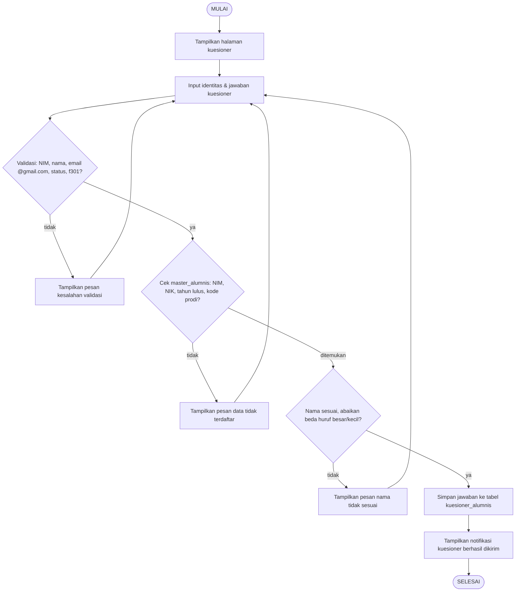

# Bab 3 — Flowchart
## Sistem Informasi Tracer Study LPKM UMMY

Flowchart (bagan alir) merupakan representasi grafis berupa simbol-simbol baku yang menggambarkan urutan langkah, keputusan, dan alur proses dalam suatu sistem. Simbol yang digunakan pada flowchart sistem ini terdiri atas simbol terminasi (mulai/selesai) yang menandai awal dan akhir proses, simbol proses berbentuk persegi panjang yang menggambarkan kegiatan pengolahan, simbol keputusan berbentuk belah ketupat yang menggambarkan percabangan dengan jawaban ya atau tidak, serta panah yang menunjukkan arah aliran proses. Pada Sistem Informasi Tracer Study LPKM UMMY, flowchart menggambarkan empat proses utama, yaitu alur login admin, alur pengisian kuesioner oleh alumni yang mencakup validasi dan verifikasi data terhadap tabel `master_alumnis`, alur impor data master alumni dari berkas Excel, serta alur dashboard analitik dan ekspor laporan Excel.

## 1. Flowchart Login Admin

```
                        ┌────────────────────┐
                        │      MULAI         │
                        └─────────┬──────────┘
                                  ▼
                        ┌────────────────────┐
                        │  Tampilkan halaman │
                        │      login         │
                        └─────────┬──────────┘
                                  ▼
                        ┌────────────────────┐
                        │  Input email dan   │
                        │      password      │
                        └─────────┬──────────┘
                                  ▼
                   ┌─────────────────────────────┐
                   │   Validasi: email & password│
                   │        wajib diisi?         │
                   └──────┬──────────────┬───────┘
                     tidak│              │ya
                          ▼              ▼
              ┌───────────────────┐ ┌───────────────────────────┐
              │ Tampilkan pesan   │ │  Autentikasi: data cocok  │
              │ kesalahan validasi│ │  dengan tabel users?      │
              └─────────┬─────────┘ └──────┬───────────┬────────┘
                        │              tidak│           │ya
                        ▼                  ▼           ▼
               (kembali ke                │   ┌────────────────────────┐
                input login)              │   │ Perbarui sesi & arahkan│
                        │                 │   │ ke dashboard kuesioner │
                        └─────────────────┘   └───────────┬────────────┘
                                                        ▼
                                               ┌────────────────────┐
                                               │      SELESAI       │
                                               └────────────────────┘
```

## 2. Flowchart Pengisian Kuesioner Alumni

```
                    ┌──────────────────────┐
                    │        MULAI         │
                    └──────────┬───────────┘
                               ▼
                    ┌──────────────────────┐
                    │  Tampilkan halaman   │
                    │      kuesioner       │
                    └──────────┬───────────┘
                               ▼
                    ┌──────────────────────┐
                    │  Input identitas &   │
                    │ jawaban kuesioner    │
                    └──────────┬───────────┘
                               ▼
              ┌──────────────────────────────────┐
              │ Validasi: NIM, nama, email,      │
              │ status, f301 wajib terisi &      │
              │ email @gmail.com?                │
              └───────┬────────────────┬─────────┘
                tidak │                │ ya
                      ▼                ▼
        ┌───────────────────┐ ┌───────────────────────────────────┐
        │ Tampilkan pesan   │ │  Cek data master_alumnis: NIM,    │
        │ kesalahan validasi│ │  NIK, tahun lulus, kode prodi?    │
        └─────────┬─────────┘ └───────┬───────────────────┬───────┘
                  │              tidak│                   │ ditemukan
                  ▼                   ▼                   ▼
        (kembali ke input) ┌──────────────────┐ ┌────────────────────────────┐
                  │        │ Tampilkan pesan  │ │ Cek nama sesuai (abaikan   │
                  └────────│ "data tidak      │ │ beda huruf besar/kecil)?   │
                           │ terdaftar"       │ └──────┬─────────────┬───────┘
                           └──────────────────┘  tidak │             │ ya
                                                    ▼             ▼
                                           ┌──────────────┐ ┌────────────────────────┐
                                           │ Tampilkan    │ │ Simpan jawaban ke      │
                                           │ pesan "nama  │ │ tabel kuesioner_alumnis│
                                           │ tidak sesuai"│ │ (updateOrInsert)       │
                                           └──────────────┘ └───────────┬────────────┘
                                                                       ▼
                                                              ┌────────────────────┐
                                                              │ Tampilkan notifikasi│
                                                              │ kuesioner berhasil  │
                                                              │ dikirim              │
                                                              └──────────┬─────────┘
                                                                         ▼
                                                                ┌────────────────────┐
                                                                │      SELESAI       │
                                                                └────────────────────┘
```

## 3. Flowchart Import Data Master Alumni

```
                     ┌────────────────────┐
                     │      MULAI         │
                     └─────────┬──────────┘
                               ▼
                     ┌────────────────────┐
                     │  Pilih berkas      │
                     │  Excel (xlsx/xls/  │
                     │  csv)              │
                     └─────────┬──────────┘
                               ▼
                ┌────────────────────────────────┐
                │ Validasi: berkas wajib, format │
                │ xlsx/xls/csv, maks 10 MB?      │
                └──────┬───────────────┬─────────┘
                 tidak │               │ ya
                       ▼               ▼
             ┌────────────────┐ ┌─────────────────────────────────┐
             │ Tampilkan pesan│ │ Baca berkas via AlumniImport   │
             │ kesalahan      │ │ (lewati baris judul/kosong)    │
             └───────┬────────┘ └──────────────┬─────────────────┘
                     │                         ▼
                     │                ┌────────────────────────────────┐
                     │                │ Simpan tiap baris ke tabel     │
                     │                │ master_alumnis                 │
                     │                └──────────────┬─────────────────┘
                     │                               ▼
                     │               ┌───────────────────────────────┐
                     │               │ Berhasil atau terjadi error?  │
                     │               └──────┬───────────────┬────────┘
                     │                error│               │ berhasil
                     ▼                      ▼               ▼
             (kembali ke           ┌────────────────┐ ┌─────────────────────┐
              pilih berkas)        │ Tampilkan pesan│ │ Tampilkan notifikasi│
                                   │ kesalahan      │ │ "data master        │
                                   │ impor          │ │ diperbarui"         │
                                   └────────────────┘ └──────────┬──────────┘
                                                                 ▼
                                                        ┌────────────────────┐
                                                        │      SELESAI       │
                                                        └────────────────────┘
```

## 4. Flowchart Dashboard Analitik & Ekspor Laporan

```
                      ┌────────────────────┐
                      │      MULAI         │
                      └─────────┬──────────┘
                                ▼
                      ┌────────────────────┐
                      │ Pilih filter:      │
                      │ tahun lulus &      │
                      │ kode prodi (opsional)
                      └─────────┬──────────┘
                                ▼
                      ┌────────────────────┐
                      │ Ambil data dari    │
                      │ kuesioner_alumnis  │
                      └─────────┬──────────┘
                                ▼
                      ┌────────────────────┐
                      │ Hitung agregasi    │
                      │ untuk semua grafik │
                      └─────────┬──────────┘
                                ▼
               ┌────────────────────────────────┐
               │  Aksi admin?                    │
               └───────┬─────────────┬──────────┘
                 lihat │             │ ekspor
                 dashboard            │
                       ▼              ▼
             ┌──────────────────┐ ┌─────────────────────────────────┐
             │ Tampilkan grafik │ │ Ambil data sesuai filter &      │
             │ Chart.js + nama  │ │ urutkan (tahun, prodi, nama)    │
             │ alumni per irisan│ └──────────────┬──────────────────┘
             └─────────┬────────┘                ▼
                       │              ┌─────────────────────────────────┐
                       │              │ Bangun berkas Excel via         │
                       │              │ KuesionerAlumniExport           │
                       │              └──────────────┬──────────────────┘
                       │                             ▼
                       │              ┌─────────────────────────────────┐
                       │              │ Unduh berkas .xlsx              │
                       │              └──────────────┬──────────────────┘
                       │                             ▼
                       ▼              ┌────────────────────┐
             ┌──────────────────┐     │      SELESAI       │
             │      SELESAI     │     └────────────────────┘
             └──────────────────┘
```

---

## Kode Mermaid (cadangan — Flowchart Pengisian Kuesioner)


