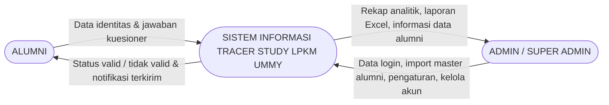

# Bab 3 — Diagram Konteks (DFD Level 0)
## Sistem Informasi Tracer Study LPKM UMMY

Diagram konteks (Diagram Arus Data Level 0) merupakan diagram arus data pada level tertinggi yang menggambarkan sistem secara keseluruhan sebagai satu kesatuan proses tunggal beserta hubungannya dengan entitas-entitas eksternal di luar sistem. Diagram konteks pada Sistem Informasi Tracer Study LPKM UMMY menggambarkan dua entitas eksternal, yaitu Alumni yang berperan sebagai pengisi kuesioner dan Admin/Super Admin yang berperan sebagai pengelola sistem. Seluruh aliran data yang masuk dan keluar dari proses pusat digambarkan dalam bentuk panah yang diberi label, yaitu data identitas dan jawaban kuesioner yang dikirim alumni, status valid atau tidak valid beserta notifikasi yang dikembalikan sistem kepada alumni, data login, data master alumni, data pengaturan, dan data akun yang dikirim admin, serta rekap analitik, berkas laporan Excel, dan informasi data alumni yang dikembalikan sistem kepada admin. Dengan diagram ini, batasan sistem dan interaksi antara sistem dengan lingkungan luarnya dapat terlihat secara utuh dalam satu gambaran tunggal.

```
   (1) Data identitas & jawaban kuesioner    (3) Data login, import master alumni,
   ───────────────────────────────────────►      pengaturan, kelola akun
                                           ◄────────────────────────────────
 ┌─────────────────┐   ┌──────────────────────────────────────────────┐   ┌──────────────────┐
 │                 │   │                                              │   │                  │
 │     ALUMNI      │   │      SISTEM INFORMASI TRACER STUDY           │   │   ADMIN /        │
 │                 │   │               LPKM UMMY                      │   │   SUPER ADMIN    │
 │                 │   │                                              │   │                  │
 └─────────────────┘   └──────────────────────────────────────────────┘   └──────────────────┘
        ▲                       ▲                               ▲                ▲
        │ (2) Status valid /    │  (4) Rekap analitik,          │                │
        │     tidak valid &     │      laporan Excel,           │                │
        │     notifikasi        │      informasi data alumni    │                │
        │     terkirim          │                               │                │
```

**Keterangan Aliran Data:**

| No | Arah | Aliran Data | Sumber → Tujuan |
|----|------|-------------|------------------|
| 1 | Masuk | Data identitas alumni (NIM, NIK, nama, tahun lulus, kode prodi) dan seluruh jawaban kuesioner | Alumni → Sistem |
| 2 | Keluar | Status valid/tidak valid data alumni, pesan kesalahan, dan notifikasi kuesioner berhasil dikirim | Sistem → Alumni |
| 3 | Masuk | Data login (email, password), data master alumni (Excel), data pengaturan, dan data akun | Admin/Super Admin → Sistem |
| 4 | Keluar | Rekap analitik dashboard, berkas laporan Excel, dan informasi data alumni | Sistem → Admin/Super Admin |

---

## Kode Mermaid (cadangan, untuk dirender menjadi gambar)


